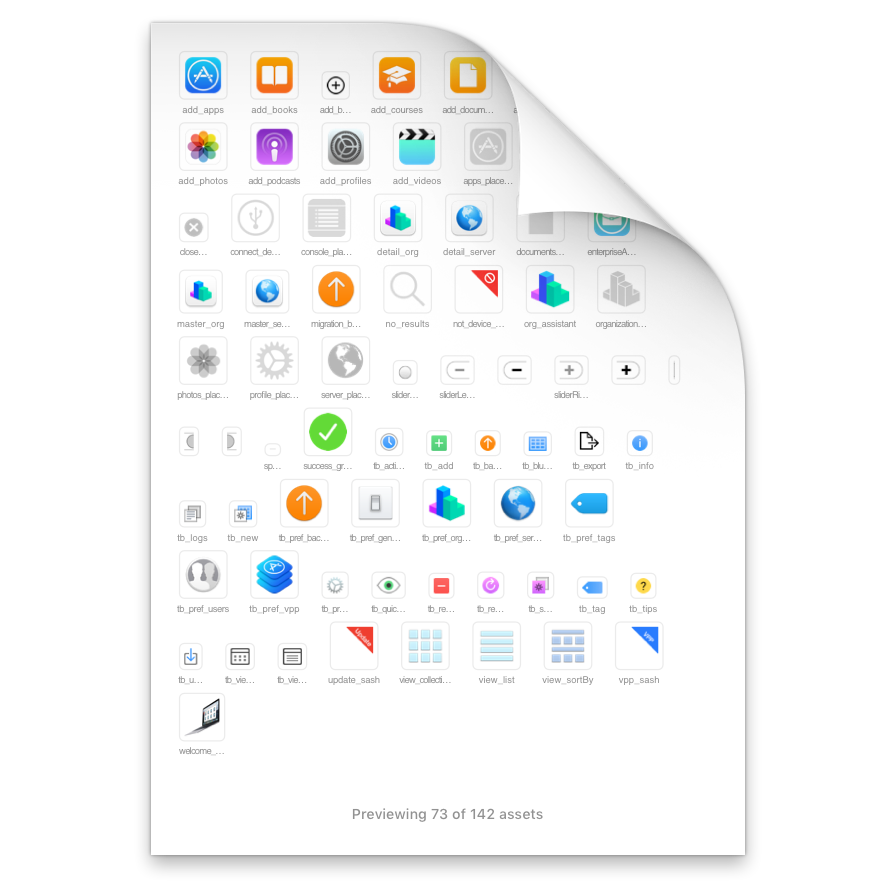

If you want to support my open source projects financially, you can do so by purchasing a copy of [BrowserFreedom](https://getbrowserfreedom.com), [Mediunic](https://itunes.apple.com/app/mediunic-medium-client/id1088945121?mt=12) or sending Bitcoin to `3DH9B42m6k2A89hy1Diz3Vr3cpDNQTQCbJ` 😁

## Asset Catalog Tinkerer

An app that lets you open `.car` files and browse/extract their images, or preview them on Finder with QuickLook.

[⬇ Download Latest Release](https://github.com/insidegui/AssetCatalogTinkerer/raw/master/releases/AssetCatalogTinkerer_latest.zip)

You can also install it using [Homebrew Cask](https://caskroom.github.io), simply `brew cask install asset-catalog-tinkerer`!

### QuickLook PlugIn

The app also includes a QuickLook PlugIn so you can see previews of asset catalogs in QuickLook.

---

### How to use

The app can open any `.car` file, usually located within an app's `Resources` directory.

Once you have an asset catalog opened, you can drag individual assets out or export the entire catalog / selected images to a directory.

### Supported file types

Since version 2.2, Asset Catalog Tinkerer can now read theme store files, not only catalog files.

Theme store files contain assets for UI components, you can find examples of them in `/System/Library/CoreServices/SystemAppearance.bundle`. The app also supports ProKit's theme stores found inside `ProKit.framework`, `LunaKit.framework` and other folders within pro apps.

